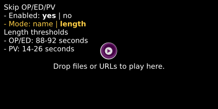

[mpv](https://github.com/mpv-player/mpv) script to automatically skip opening, ending or preview chapters.

If chapters are properly named (i.e. not `Chapter 1`, `Chapter 2`, etc), works by matching on the chapter name.
Otherwise by checking the chapter length.

# Installation

https://github.com/mpv-player/mpv/wiki/User-Scripts

Copy the script into mpv scripts directory

- Linux or MacOS: `~/.config/mpv/scripts/`
- Windows: `C:/Users/Username/AppData/Roaming/mpv/scripts/`

# Keybind

Can be configured by editing the `KEYBIND` variable at the top of the script. By default, `y` key is used.

`y` to enable or disable the script.

`Y` to manually switch between modes of operation.

`Ctrl+y` to bring up configuration menu. Press `Ctrl+y` again or `Esc` to dismiss it.

# Chapter name patterns

Can be configured by editing `PATTERNS_EXACT`, `PATTERNS_START` and `PATTERNS_END` variables at the top of the script.

# Chapter length thresholds

Default value can be configured by editing `OP_ED_THRESHOLD` and `PV_THRESHOLD` tables. Also can be configured from `Ctrl+y` menu, but changes made there are not saved.
